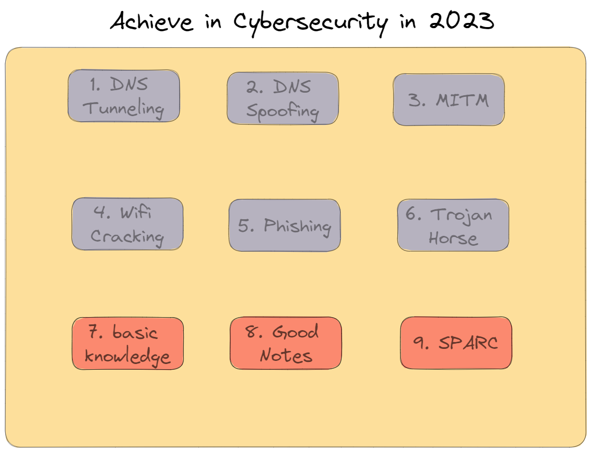

# Goals in 2023 🚀

In the year 2023, I have set out several objectives that I am keen on achieving.
These targets will enable me to broaden my horizons, gain valuable knowledge and experience, and create a comprehensive documentation of my journey.
I am optimistic that with determination and hard work, I will achieve these goals and produce remarkable outcomes.  
  
This Image represents the things i would like to learn in this Year:

1. DNS Tunneling:
2. DNS Spoofing:
3. Man-in-the-Middle
4. Wifi-Cracking
5. Phising
6. Trojan-Horse
7. Basic-Knowledge
8. Good Notes
9. SPARC
